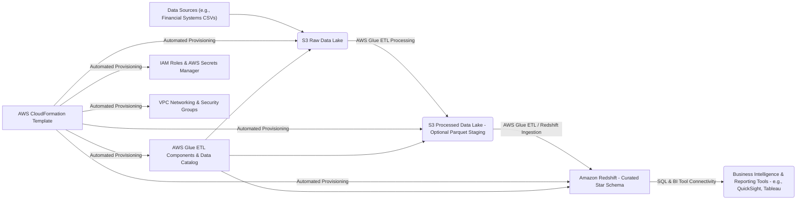
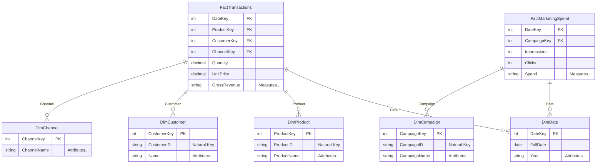
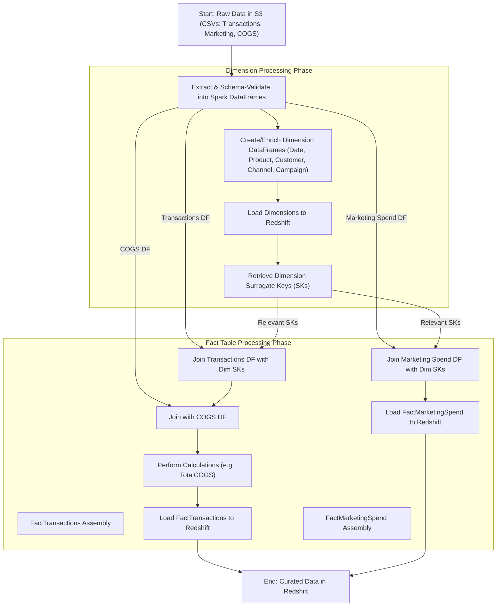

# Finance Analytics Platform (AWS PoC)

[](https://opensource.org/licenses/MIT)

This proof-of-concept (PoC) presents a scalable, self-service finance analytics platform architected on Amazon Web Services (AWS). It demonstrates a comprehensive, end-to-end data pipeline, encompassing data ingestion into Amazon S3, sophisticated ETL transformations with AWS Glue, robust data warehousing in Amazon Redshift, and automated infrastructure provisioning via AWS CloudFormation.

## The Challenge: Modernizing Financial Analytics

Organizations frequently grapple with significant challenges in their financial data analytics capabilities. Common obstacles include:

*   **Fragmented Data Landscapes:** Critical financial data often resides in disparate silos, hindering unified analysis and insights.
*   **Inefficient Manual Processes:** Labor-intensive manual efforts for data extraction, transformation, and loading (ETL) are prone to errors and delays.
*   **Scalability Constraints:** Legacy solutions often fail to scale effectively with escalating data volumes and the increasing complexity of analytical demands.
*   **Delayed Insights:** Protracted timelines for accessing and analyzing financial data impede agile, data-driven strategic decision-making.
*   **IT Bottlenecks:** Heavy reliance on technical teams for custom reporting and data provisioning can create significant delays for business users.

This PoC provides a robust blueprint for an automated, scalable, and centralized financial analytics solution on AWS, designed to overcome these prevalent challenges.

## Strategic Objectives

This project aims to achieve the following key objectives:

*   **End-to-End Data Pipeline Implementation:** Demonstrate a seamless and automated data flow from raw source systems to a curated analytical data warehouse.
*   **Leverage AWS Managed Services:** Capitalize on the scalability, reliability, and operational efficiency of core AWS services, including S3, Glue, and Redshift.
*   **Optimized Data Warehousing:** Implement a star schema data model in Amazon Redshift, engineered for high-performance analytical querying.
*   **Automated ETL Workflows:** Employ AWS Glue to deliver robust, repeatable, and maintainable data transformation and loading processes.
*   **Infrastructure as Code (IaC):** Define and manage the entire AWS infrastructure using AWS CloudFormation, ensuring consistency, repeatability, and version control.
*   **Empower Self-Service Analytics:** Provide business users with direct access to clean, structured, and analysis-ready data, suitable for leading BI tools (e.g., Amazon QuickSight, Tableau).
*   **Enhanced Data Security:** Integrate AWS Secrets Manager for secure credential management and implement a meticulously designed VPC architecture to ensure network integrity.

## Architectural Blueprint

The platform employs a modern data warehousing architecture leveraging the following AWS services:

1.  **Data Ingestion (Amazon S3):** Raw data files (e.g., CSVs from ERPs, financial systems) are consolidated in an Amazon S3 bucket, establishing a central data lake.
2.  **ETL Processing (AWS Glue):**
    *   AWS Glue ETL jobs, utilizing PySpark, orchestrate the extraction of data from the S3 raw data zone.
    *   Core transformations encompass data cleansing, type standardization, application of business rules, dataset integration (e.g., transactions, marketing spend, COGS), and precise mapping to the target Redshift schema.
    *   Optionally, transformed data can be staged in a processed S3 zone in an optimized columnar format (e.g., Apache Parquet) prior to Redshift ingestion.
    *   The AWS Glue Data Catalog serves as a centralized metadata repository for data sources, transformations, and targets.
3.  **Data Warehousing (Amazon Redshift):**
    *   Amazon Redshift functions as the cloud-native data warehouse, storing curated financial data within a star schema optimized for analytics.
    *   Dimension and fact tables are meticulously designed to support high-performance analytical queries and complex reporting.
4.  **Infrastructure Automation (AWS CloudFormation):**
    *   The entire infrastructure stack—including VPC, S3 buckets, IAM roles, Redshift cluster, Glue components, and Secrets Manager integration—is declaratively defined and programmatically deployed via AWS CloudFormation.
5.  **Security Framework (AWS IAM, Secrets Manager, VPC):**
    *   AWS Identity and Access Management (IAM) roles and policies enforce granular permissions across all AWS services, adhering to the principle of least privilege.
    *   AWS Secrets Manager safeguards the Redshift master database password.
    *   A custom Amazon VPC, featuring public and private subnets, NAT Gateways, and an S3 Gateway Endpoint, provides a secure and isolated network environment.



## Core Technologies

*   **Data Lake:** Amazon S3
*   **ETL Engine:** AWS Glue (PySpark, Glue Data Catalog)
*   **Data Warehouse:** Amazon Redshift
*   **Infrastructure as Code:** AWS CloudFormation
*   **Secrets Management:** AWS Secrets Manager
*   **Networking:** Amazon VPC (Virtual Private Cloud)
*   **Identity & Access Management:** AWS IAM
*   **Business Intelligence (Conceptual):** Amazon QuickSight, Tableau, or compatible BI platforms.

## Project Structure

```
aws_finance_analytics_poc/
├── data/
│   ├── raw/                # Source data extracts (transactions.csv, marketing_spend.csv, cogs.csv)
│   │   ├── transactions.csv
│   │   ├── marketing_spend.csv
│   │   └── cogs.csv
│   └── processed/          # Staging area for processed data (e.g., Parquet) - managed by Glue
│       └── .gitkeep
├── docs/
│   └── .gitkeep            # Supplementary project documentation
├── etl/
│   └── glue_etl_job.py     # Core PySpark script for the AWS Glue ETL job
├── infra/
│   └── cloudformation_template.yaml # AWS CloudFormation template for infrastructure deployment
├── sql/
│   ├── ddl/                # Data Definition Language (DDL) scripts for Redshift tables
│   │   ├── create_dimensions.sql
│   │   └── create_facts.sql
│   ├── sample_queries/     # Example SQL queries for data validation and exploration
│   │   ├── sample_dimension_queries.sql
│   │   └── sample_fact_queries.sql
├── .gitignore
├── LICENSE.md
└── README.md
```

## Data Model: Redshift Star Schema

A star schema is employed within Amazon Redshift to deliver an optimized structure for analytical queries. This model is tailored for multi-channel commerce analytics, integrating sales transactions, marketing expenditures, and cost of goods sold (COGS) data.

*   **Fact Tables:** These tables store quantitative transactional data and foreign keys referencing dimension tables.
    *   `FactTransactions`: Captures granular transaction-level details, including measures like `Quantity`, `UnitPrice`, `GrossRevenue`, `NetRevenue`, `TaxAmount`, `ShippingChargedToCustomer`, `ActualShippingCost`, various platform-specific fees, `UnitCOGS`, `CalculatedTotalCOGS`, and `ReturnFlag`.
    *   `FactMarketingSpend`: Records marketing campaign performance metrics, such as `Impressions`, `Clicks`, and `Spend`.
*   **Dimension Tables:** These tables provide descriptive context to the fact data.
    *   `DimDate`: Offers comprehensive date attributes including `DateKey`, `FullDate`, `Year`, `Quarter`, `Month`, `MonthName`, `DayOfMonth`, `DayOfWeekName`, `WeekOfYear`, and `IsWeekend`.
    *   `DimProduct`: Contains product-specific details like `ProductKey`, `ProductID` (natural key), and `ProductName`.
    *   `DimCustomer`: Stores customer identifiers such as `CustomerKey` and `CustomerID` (natural key).
    *   `DimChannel`: Describes sales channels with attributes like `ChannelKey` and `ChannelName`.
    *   `DimCampaign`: Details marketing campaigns, including `CampaignKey`, `CampaignID` (natural key), `CampaignName`, and `AdPlatform`.

#### Visual Data Model (Star Schema ERD)



*(Detailed DDL scripts are available in the `sql/ddl/` directory.)*

## ETL Process Deep Dive: AWS Glue Job (`glue_etl_job.py`)

The core ETL logic resides in the `etl/glue_etl_job.py` PySpark script, which executes the following orchestrated sequence of operations:

#### Visual ETL Process Flow



1.  **Data Extraction & Schema Enforcement:** The process initiates by ingesting raw `transactions.csv`, `marketing_spend.csv`, and `cogs.csv` files from the designated S3 raw data bucket. Predefined schemas are rigorously applied during ingestion to ensure data type consistency and integrity from the outset.
2.  **Dimension Table Construction & Enrichment:**
    *   **`DimDate` Generation:** A dynamic `DimDate` table is constructed, spanning the complete date range derived from transaction and marketing spend data. A fallback to the current calendar year is implemented if source date ranges are unavailable.
    *   **Source-Driven Dimension Population:** `DimProduct`, `DimCustomer`, `DimChannel`, and `DimCampaign` are populated by extracting distinct values for their respective attributes (e.g., `ProductID`, `CustomerID`) from the source DataFrames. This ensures dimensions accurately reflect the entities present in the raw data.
    *   **Redshift Loading & Surrogate Key Acquisition:** The newly formed dimension DataFrames are loaded into their corresponding Redshift tables. Critically, the script then queries these tables to retrieve the Redshift-generated surrogate keys (e.g., `ProductKey`, `CustomerKey`). These surrogate keys are indispensable for establishing robust relationships in the fact tables.
3.  **Fact Table Assembly & Loading:**
    *   **`FactTransactions` Assembly:** This involves several key steps:
        *   **COGS Integration:** Transaction data is enriched by joining with `cogs_df`. The logic identifies the precise `UnitCOGS` for each product effective at the transaction's timestamp, selecting the COGS record with the most recent `COGS_EffectiveDate` on or before the `TransactionDate`.
        *   **Cost Calculation:** `CalculatedTotalCOGS` is derived (`Quantity * UnitCOGS`).
        *   **Surrogate Key Mapping:** Natural keys within the transaction data are replaced with their corresponding surrogate keys retrieved from the `DimDate`, `DimProduct`, `DimCustomer`, and `DimChannel` lookup DataFrames.
        *   **Finalization & Load:** Columns are selected and aliased to conform to the `FactTransactions` Redshift schema, and the finalized DataFrame is loaded.
    *   **`FactMarketingSpend` Assembly:**
        *   **Surrogate Key Mapping:** Natural keys are replaced with surrogate keys from `DimDate` and `DimCampaign` lookups.
        *   **Finalization & Load:** Columns are selected and aliased for the `FactMarketingSpend` Redshift schema, followed by data loading.
4.  **Data Integrity & Type Management:** Throughout the pipeline, strict adherence to correct data types (e.g., `DecimalType` for financial values, `DateType` for temporal fields) is maintained. Null value handling, such as `na.drop` for essential identifiers during dimension creation, safeguards data quality.
5.  **Redshift Interaction Protocol:** Communication with Amazon Redshift is managed via JDBC connections. The `load_and_write_to_redshift` utility function incorporates `preactions` to truncate target tables prior to data loading, ensuring idempotent behavior for full data refresh scenarios.
6.  **Efficient Resource Utilization:** Cached PySpark DataFrames are explicitly unpersisted once their role in the transformation is complete, optimizing memory usage within the Glue job environment.

## Infrastructure Provisioning: CloudFormation (`cloudformation_template.yaml`)

The `infra/cloudformation_template.yaml` template orchestrates the deployment of the entire AWS infrastructure stack. Key components include:

*   **Virtual Private Cloud (VPC):** A custom VPC configured with public and private subnets distributed across multiple Availability Zones, NAT Gateways for controlled outbound internet access from private subnets, an Internet Gateway, meticulously defined Route Tables, and an S3 Gateway Endpoint for secure, private S3 access.
*   **Amazon Redshift Cluster:** Provisions the Redshift cluster, associated subnet group, and a security group configured to permit access from AWS Glue and specified IP ranges for administrative purposes.
*   **AWS Glue Components:** Defines IAM roles tailored for Glue execution, the Glue job definition itself (with the script sourced from S3), and potentially Glue crawlers or Data Catalog resources as the project evolves.
*   **Amazon S3 Buckets:** Creates dedicated S3 buckets for storing raw input data, staging processed data (optional), housing Glue ETL scripts, and collecting operational logs.
*   **AWS Secrets Manager:** Establishes a secret for securely storing the Redshift master password, which is then referenced by the CloudFormation template during Redshift cluster creation.
*   **IAM Roles & Policies:** Implements fine-grained IAM roles for Redshift (enabling S3 access for `COPY` commands) and Glue (granting necessary permissions for S3, Redshift, Secrets Manager, and CloudWatch Logs), strictly adhering to the principle of least privilege.
*   **Parameterization & Outputs:** The template incorporates customizable parameters for deployment flexibility (e.g., VPC CIDR blocks, Redshift node types, administrator usernames) and exports critical resource identifiers as stack outputs for easy reference.

## Setup and Deployment Guide

1.  **Prerequisites:** An active AWS account, AWS Command Line Interface (CLI) configured with appropriate credentials, Python, and IAM permissions sufficient for CloudFormation stack deployment and resource creation.
2.  **Clone Repository:** Obtain the project source code: `git clone <repository-url>`
3.  **Parameter Configuration:** Review and customize parameters within `infra/cloudformation_template.yaml` as needed (e.g., `ProjectPrefix`, `VPCCIDR`, `RedshiftMasterUsername`).
4.  **Upload Glue Script to S3:** Manually transfer the `etl/glue_etl_job.py` script to the S3 bucket designated for Glue scripts. This bucket is created by the CloudFormation stack; its name can be identified from stack outputs or pre-determined based on `ProjectPrefix`.
5.  **Deploy CloudFormation Stack:** Execute the following AWS CLI command to deploy the infrastructure:
    ```bash
    aws cloudformation deploy \
        --template-file infra/cloudformation_template.yaml \
        --stack-name <your-chosen-stack-name> \
        --capabilities CAPABILITY_IAM CAPABILITY_NAMED_IAM \
        --parameter-overrides ProjectPrefix=<YourProjectPrefix> RedshiftMasterUserPassword=<YourSecurePasswordForSecret> # Append other necessary parameter overrides
    ```
    *Security Note: The provided template creates an AWS Secret for the Redshift password. Ensure the `RedshiftMasterUserPassword` parameter override is a strong, unique password intended for storage in Secrets Manager.*
6.  **Prepare Raw Data:** Upload the sample CSV files (`transactions.csv`, `marketing_spend.csv`, `cogs.csv`) from the `data/raw/` directory to the S3 raw data bucket provisioned by the CloudFormation stack.
7.  **Execute AWS Glue ETL Job:** Trigger the AWS Glue ETL job (e.g., `YourProjectPrefix-Financial-ETL-Job`) via the AWS Glue console or programmatically using the AWS CLI/SDK. Confirm that the Glue job's script path correctly points to the S3 location of `glue_etl_job.py`.
8.  **Connect to Amazon Redshift:** Utilize the Redshift cluster endpoint (available as a CloudFormation stack output or from the AWS console) and credentials (master username specified during stack deployment, password retrievable from the corresponding AWS Secret) to establish a connection using a preferred SQL client.
9.  **Validate and Explore Data:** Connect to your Redshift cluster using a SQL client. Execute the sample queries provided in `sql/sample_queries/sample_dimension_queries.sql` and `sql/sample_queries/sample_fact_queries.sql` to verify data integrity and explore the populated tables. Subsequently, connect BI tools for advanced visualization and interactive analysis.

## Key Technical Distinctions

*   **Fully Automated Infrastructure:** AWS CloudFormation ensures consistent, repeatable, and version-controlled environment provisioning.
*   **Scalable Data Processing Architecture:** AWS Glue and Amazon Redshift provide robust, independently scalable components capable of handling significant data volumes and complex transformations.
*   **Modular and Decoupled Design:** The architecture promotes modularity, allowing individual components (S3, Glue, Redshift) to be scaled and updated independently.
*   **Security-Centric Approach:** Leverages VPC network isolation, fine-grained IAM permissions, and AWS Secrets Manager for comprehensive security.
*   **Optimized for Analytical Performance:** The star schema design in Redshift, coupled with optional Parquet staging, is engineered to enhance analytical query performance and efficiency.

## Strategic Future Enhancements (Technical Roadmap)

*   **Event-Driven ETL Orchestration:** Transition to an event-driven model by implementing S3 event triggers for Glue jobs, enabling near real-time data processing upon arrival of new raw data.
*   **Automated API-Based Data Ingestion:** Integrate directly with financial system APIs (e.g., Shopify API, Amazon Selling Partner API, various advertising platform APIs) using AWS AppFlow or custom AWS Lambda functions for more resilient and automated data acquisition.
*   **Advanced Data Modeling Techniques:** Incorporate Slowly Changing Dimensions (SCDs Type 2 or Type 6) to track historical changes in dimensional attributes and explore more complex fact table relationships.
*   **Data Quality Assurance Framework:** Embed automated data quality checks and validation rules directly into the AWS Glue ETL pipeline using frameworks like AWS Deequ or custom PySpark validation logic.
*   **CI/CD for Infrastructure and ETL Code:** Establish a robust CI/CD pipeline (e.g., using AWS CodePipeline, AWS CodeBuild, and AWS CodeDeploy, or GitHub Actions) for managing and deploying CloudFormation templates and Glue ETL scripts.
*   **Granular Redshift Access Control & Security:** Implement more granular access control within Redshift by defining specific user roles, groups, and row-level or column-level security policies.
*   **Sophisticated Workflow Orchestration:** Utilize AWS Step Functions to orchestrate complex ETL workflows involving multiple interdependent jobs, conditional execution paths, comprehensive error handling, and retry mechanisms.

## Contributing

Contributions, innovative ideas, and constructive feedback are highly encouraged. Please feel free to open an issue to discuss potential changes or submit a pull request with your enhancements.

## License

This project is licensed under the MIT License. Please refer to the [LICENSE.md](LICENSE.md) file for full details.
