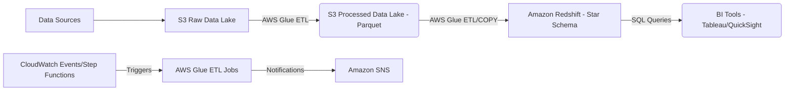

# AWS Finance Analytics Platform - Proof-of-Concept

[](https://opensource.org/licenses/MIT)

A proof-of-concept for a scalable, self-service finance analytics platform built on AWS. This project demonstrates an end-to-end data pipeline from ingestion in S3, ETL with AWS Glue, data warehousing in Amazon Redshift, and conceptual visualization.

## Table of Contents

- [Introduction](#introduction)
- [Problem Statement](#problem-statement)
- [Goals & Objectives](#goals--objectives)
- [Architectural Overview](#architectural-overview)
- [Technology Stack](#technology-stack)
- [Project Structure](#project-structure)
- [Data Model (Star Schema)](#data-model-star-schema)
- [ETL Process](#etl-process)
- [Simulated Data](#simulated-data)
- [Setup & Deployment (Conceptual)](#setup--deployment-conceptual)
- [Running the PoC (Conceptual)](#running-the-poc-conceptual)
- [Key Features](#key-features)
- [Future Enhancements](#future-enhancements)
- [Contributing](#contributing)
- [License](#license)

## Introduction

This project serves as a proof-of-concept (PoC) for building a robust and scalable finance analytics platform using Amazon Web Services (AWS). The goal is to enable self-service business intelligence (BI) capabilities, allowing finance teams to explore data, generate reports, and gain insights into cost structures, capital expenditures (CapEx), and variance analysis with minimal IT dependency.

## Problem Statement

Finance departments often struggle with:
- Siloed data sources and manual data consolidation.
- Lack of timely access to critical financial data for decision-making.
- Difficulty in performing complex analyses and generating ad-hoc reports.
- Scalability issues with existing analytics solutions.
- Over-reliance on IT for data extraction and report generation.

This PoC aims to address these challenges by providing a centralized, automated, and self-service analytics solution.

## Goals & Objectives

- **Design an end-to-end data pipeline:** From data ingestion to visualization-ready data.
- **Leverage AWS managed services:** To ensure scalability, reliability, and cost-effectiveness.
- **Implement a star schema:** For optimized analytical querying in Amazon Redshift.
- **Automate ETL processes:** Using AWS Glue for data transformation and loading.
- **Enable self-service analytics:** By providing clean, structured data for BI tools like Tableau.
- **Incorporate alerting mechanisms:** For data quality checks and process monitoring (e.g., using AWS SNS).
- **Demonstrate automated data refresh capabilities.**

## Architectural Overview

The platform follows a modern data warehousing architecture on AWS:

1.  **Data Ingestion:** Raw financial data (e.g., CSV, Excel files) is uploaded to an **Amazon S3** bucket (Data Lake - Raw Zone).
2.  **ETL Processing:**
    *   **AWS Glue Crawlers** (optional) can be used to discover schema from raw data.
    *   **AWS Glue ETL jobs** (written in PySpark) are triggered to:
        *   Extract data from the S3 Raw Zone.
        *   Transform data: cleaning, standardizing, applying business logic, joining datasets.
        *   Load transformed data into another S3 bucket (Data Lake - Processed Zone) in a query-optimized format (e.g., Parquet).
        *   Load data from the Processed Zone into **Amazon Redshift** (Data Warehouse).
3.  **Data Warehousing:**
    *   **Amazon Redshift** stores the data in a star schema, optimized for analytical queries.
    *   Dimension tables (e.g., `DimDate`, `DimDepartment`, `DimAccount`) and Fact tables (e.g., `FactFinancials`) are defined.
4.  **Data Visualization & Reporting:**
    *   BI tools like **Tableau**, Amazon QuickSight, or others connect to Amazon Redshift to create interactive dashboards and reports. (This PoC focuses on preparing data for this stage).
5.  **Orchestration & Automation:**
    *   **AWS Step Functions** or **Amazon CloudWatch Events (EventBridge)** can orchestrate the ETL pipeline (e.g., trigger Glue jobs on a schedule or S3 event).
6.  **Alerting & Monitoring:**
    *   **Amazon SNS** can be used to send notifications for ETL job success/failure or data anomalies.
    *   **Amazon CloudWatch** monitors AWS resources and logs.



## Technology Stack

-   **Data Lake:** Amazon S3
-   **ETL:** AWS Glue (PySpark)
-   **Data Warehouse:** Amazon Redshift
-   **Orchestration:** AWS Step Functions, Amazon CloudWatch Events (EventBridge)
-   **Alerting:** Amazon SNS
-   **Monitoring:** Amazon CloudWatch
-   **Infrastructure as Code (Conceptual):** AWS CloudFormation or Terraform
-   **BI/Visualization (Conceptual):** Tableau, Amazon QuickSight

## Project Structure

```
aws-finance-analytics-poc/
├── .git/
├── .gitignore
├── LICENSE.md
├── README.md
├── data/
│   ├── raw/                 # Sample raw input data (e.g., transactions.csv, budget.csv)
│   └── processed/           # Data after ETL, ready for Redshift (e.g., parquet files)
├── etl/
│   └── glue_etl_job.py      # AWS Glue PySpark script
├── sql/
│   ├── ddl/                 # Data Definition Language scripts for Redshift
│   │   ├── create_dimensions.sql
│   │   └── create_facts.sql
│   └── dml/                 # Data Manipulation Language scripts (e.g., sample inserts, queries)
│       └── sample_queries.sql
├── infra/                   # Infrastructure as Code (IaC) templates (conceptual)
│   └── cloudformation_template.yaml # (Example)
└── docs/                    # Additional documentation, design notes

```

## Data Model (Star Schema)

A star schema is chosen for its simplicity and performance benefits for analytical queries. It consists of one or more fact tables referencing any number of dimension tables.

### Fact Tables

-   **`FactFinancials`**: Central table holding quantitative measures (facts) like amount, budget amount, variance.
    -   `DateKey` (FK to `DimDate`)
    -   `DepartmentKey` (FK to `DimDepartment`)
    -   `AccountKey` (FK to `DimAccount`)
    -   `ScenarioKey` (FK to `DimScenario` - e.g., Actual, Budget)
    -   `Amount` (DECIMAL)
    -   `BudgetAmount` (DECIMAL)
    -   `Variance` (DECIMAL)
    -   `TransactionDate` (DATE)
    -   `LoadTimestamp` (TIMESTAMP)

### Dimension Tables

-   **`DimDate`**: Attributes related to date and time.
    -   `DateKey` (PK)
    -   `FullDate` (DATE)
    -   `Year` (INT)
    -   `Quarter` (INT)
    -   `Month` (INT)
    -   `Day` (INT)
    -   `WeekOfYear` (INT)
    -   `DayOfWeek` (VARCHAR)
-   **`DimDepartment`**: Attributes for different departments.
    -   `DepartmentKey` (PK)
    -   `DepartmentName` (VARCHAR)
    -   `DepartmentCode` (VARCHAR)
    -   `BusinessUnit` (VARCHAR)
-   **`DimAccount`**: Financial accounts.
    -   `AccountKey` (PK)
    -   `AccountName` (VARCHAR)
    -   `AccountNumber` (VARCHAR)
    -   `AccountType` (VARCHAR - e.g., Revenue, Expense, Asset)
    -   `Category` (VARCHAR)
-   **`DimScenario`**: Differentiates data types like Actuals vs. Budget.
    -   `ScenarioKey` (PK)
    -   `ScenarioName` (VARCHAR - e.g., "Actual", "Budget Q1", "Forecast")

## ETL Process

1.  **Extraction:**
    -   AWS Glue job reads raw financial data files (e.g., CSVs from `s3://your-bucket/data/raw/`).
2.  **Transformation:**
    -   **Data Cleaning:** Handle missing values, correct data types, remove duplicates.
    -   **Standardization:** Ensure consistent formats for dates, codes, etc.
    -   **Business Logic:** Calculate derived fields like variance (Actual - Budget).
    -   **Lookups/Joins:** Enrich data by joining with dimension-like information if present in source, or prepare for dimension key lookups.
    -   **Schema Mapping:** Transform data to fit the target star schema.
    -   **Surrogate Key Generation:** Generate surrogate keys for dimension tables if not using natural keys.
3.  **Loading:**
    -   **Processed S3:** Transformed data is written to `s3://your-bucket/data/processed/` in Parquet format.
    -   **Redshift:** Data is loaded from the processed S3 location into Redshift dimension and fact tables using the `COPY` command or Glue's Redshift connector.
        -   Dimensions are typically loaded first, followed by facts.
        -   Incremental loading strategies (e.g., based on transaction date or load timestamp) should be considered for production.

## Simulated Data

This PoC will use simulated CSV files for:
-   `transactions.csv`: Contains actual financial transaction records (date, department, account, amount).
-   `budget.csv`: Contains budgeted amounts (date/period, department, account, budget amount).

These will be placed in the `data/raw/` directory.

## Setup & Deployment (Conceptual)

This section outlines the conceptual steps to deploy the platform on AWS. Actual deployment would involve using AWS Console, CLI, or IaC tools like AWS CloudFormation or Terraform.

### Prerequisites

-   An active AWS Account.
-   AWS CLI installed and configured with appropriate administrative or power-user permissions.
-   Familiarity with S3, IAM, AWS Glue, and Amazon Redshift services.
-   A SQL client for connecting to Redshift (e.g., DBeaver, SQL Workbench/J, psql).

### Deployment Steps

1.  **Create S3 Buckets:**
    *   `your-unique-bucket-name-raw-data`: For storing raw input data files (e.g., CSVs).
    *   `your-unique-bucket-name-processed-data`: For storing transformed data in Parquet format.
    *   `your-unique-bucket-name-glue-scripts`: For storing AWS Glue ETL scripts and temporary files.
    *   _Replace `your-unique-bucket-name` with a globally unique identifier._

2.  **Set up Amazon Redshift Cluster:**
    *   Launch a new Redshift cluster (e.g., `dc2.large` or `ra3.xlplus` for PoC purposes).
    *   Configure VPC, subnets, and security groups to allow access from AWS Glue and your SQL client.
    *   Note down the cluster endpoint, database name, master username, and password.

3.  **Configure IAM Roles:**
    *   **Glue Service Role:**
        *   Create an IAM role for AWS Glue.
        *   Attach AWS managed policies: `AWSGlueServiceRole`.
        *   Attach a custom policy granting S3 access (read from raw bucket, read/write to processed and scripts buckets) and Redshift Data API access (if using it) or permissions to describe Redshift clusters.
        *   Example S3 policy snippet:
            ```json
            {
                "Version": "2012-10-17",
                "Statement": [
                    {
                        "Effect": "Allow",
                        "Action": [
                            "s3:GetObject",
                            "s3:PutObject",
                            "s3:ListBucket",
                            "s3:DeleteObject"
                        ],
                        "Resource": [
                            "arn:aws:s3:::your-unique-bucket-name-raw-data/*",
                            "arn:aws:s3:::your-unique-bucket-name-raw-data",
                            "arn:aws:s3:::your-unique-bucket-name-processed-data/*",
                            "arn:aws:s3:::your-unique-bucket-name-processed-data",
                            "arn:aws:s3:::your-unique-bucket-name-glue-scripts/*",
                            "arn:aws:s3:::your-unique-bucket-name-glue-scripts"
                        ]
                    }
                ]
            }
            ```
    *   **Redshift Cluster Role (for COPY from S3):**
        *   Create an IAM role that Redshift can assume.
        *   Attach the `AmazonS3ReadOnlyAccess` policy (or a more restrictive policy granting read access specifically to the `processed-data` S3 bucket).
        *   Associate this role with your Redshift cluster (Modify Cluster -> IAM roles).

4.  **Prepare Redshift Database:**
    *   Connect to your Redshift cluster using a SQL client.
    *   Run the DDL scripts located in `sql/ddl/create_dimensions.sql` and `sql/ddl/create_facts.sql` to create the necessary tables (DimDate, DimDepartment, DimAccount, DimScenario, FactFinancials).

5.  **Set up AWS Glue ETL Job:**
    *   Navigate to AWS Glue in the AWS Console.
    *   Add a new ETL job.
    *   Configure the job:
        *   **Name:** `FinanceAnalytics_ETL_Job`
        *   **IAM Role:** Select the Glue Service Role created in step 3.
        *   **Type:** Spark
        *   **Glue version:** Choose a recent version (e.g., Glue 3.0 or 4.0).
        *   **Script location:** Upload the `etl/glue_etl_job.py` script to your `glue-scripts` S3 bucket and point the job to this S3 path.
        *   **Data source(s) (conceptual, configured in script):** The script will read from the `raw-data` S3 bucket.
        *   **Data target(s) (conceptual, configured in script):** The script will write to the `processed-data` S3 bucket and load into Redshift.
        *   **Job parameters (examples, can be passed to the script):**
            *   `--RAW_S3_PATH`: `s3://your-unique-bucket-name-raw-data/`
            *   `--PROCESSED_S3_PATH`: `s3://your-unique-bucket-name-processed-data/`
            *   `--REDSHIFT_JDBC_URL`: `jdbc:redshift://your-redshift-cluster-endpoint:5439/your_db_name`
            *   `--REDSHIFT_USER`: `your_redshift_master_username`
            *   `--REDSHIFT_PASSWORD_SECRET_NAME`: (Optional) Name of AWS Secrets Manager secret for Redshift password.
            *   `--TEMP_S3_DIR`: `s3://your-unique-bucket-name-glue-scripts/temp/`
        *   **Connections:** Add a Redshift connection if your Glue job needs to connect directly via JDBC (provide JDBC URL, username, password/secret).

6.  **Orchestration & Scheduling (Optional but Recommended):**
    *   Use **Amazon CloudWatch Events (EventBridge)** to trigger the Glue ETL job on a schedule (e.g., daily) or based on S3 `PutObject` events in the raw data bucket.
    *   For more complex workflows, consider **AWS Step Functions** to orchestrate multiple Glue jobs, Lambda functions, etc.

7.  **Alerting (Optional):**
    *   Configure **Amazon SNS** topics.
    *   Set up Glue job notifications (on success, failure, timeout) to publish to the SNS topic.
    *   Subscribe email addresses or other endpoints to the SNS topic.

## Running the PoC (Conceptual)

1.  **Upload Sample Data:**
    *   Place your simulated `transactions.csv` and `budget.csv` files into the `data/raw/` directory locally.
    *   Upload these files to your `s3://your-unique-bucket-name-raw-data/` S3 bucket.

2.  **Manually Run the Glue ETL Job:**
    *   Go to the AWS Glue console.
    *   Select the `FinanceAnalytics_ETL_Job`.
    *   Start the job run. Provide any necessary job parameters if not hardcoded or if you wish to override defaults.

3.  **Monitor Job Execution:**
    *   Monitor the Glue job status in the console.
    *   Check CloudWatch Logs for detailed logging from the PySpark script.

4.  **Verify Data:**
    *   **Processed S3 Data:** Check your `s3://your-unique-bucket-name-processed-data/` bucket for Parquet files (e.g., `fact_financials/`, `dim_date/`, etc.).
    *   **Redshift Data:** Connect to your Redshift cluster using a SQL client.
        *   Run `SELECT COUNT(*) FROM DimDate;`, `SELECT COUNT(*) FROM FactFinancials;` etc., to verify data loading.
        *   Execute sample queries from `sql/dml/sample_queries.sql` to explore the data.

5.  **Connect BI Tool (Conceptual):**
    *   Configure Tableau, Amazon QuickSight, or your preferred BI tool to connect to your Amazon Redshift cluster.
    *   Use the Redshift endpoint, database name, username, and password.
    *   Start building dashboards and visualizations based on the `FactFinancials` and its related dimension tables.

## Key Features

-   **End-to-End Data Pipeline:** Demonstrates the flow of data from raw sources to an analytical data warehouse.
-   **Scalable AWS Architecture:** Leverages managed AWS services designed for scalability and performance.
-   **Star Schema Data Model:** Optimized for efficient BI querying and reporting.
-   **Automated ETL:** Utilizes AWS Glue for robust and repeatable data transformation processes.
-   **Self-Service Analytics Focus:** Aims to provide data in a format that empowers end-users.
-   **Modularity:** Components (S3, Glue, Redshift) can be individually scaled and managed.

## Future Enhancements

-   **Infrastructure as Code (IaC):** Implement full deployment automation using AWS CloudFormation or Terraform.
-   **CI/CD Pipeline:** Set up a CI/CD pipeline (e.g., AWS CodePipeline, GitHub Actions) for automated testing and deployment of Glue scripts and SQL DDL.
-   **Data Quality Checks:** Integrate more comprehensive data quality checks within the ETL process (e.g., using Deequ on Glue or dbt tests).
-   **Advanced Orchestration:** Implement AWS Step Functions for more sophisticated workflow management and error handling.
-   **Security Enhancements:** Implement fine-grained access control, encryption at rest and in transit, and VPC endpoints.
-   **Incremental Data Loading:** Refine ETL scripts for efficient incremental loading of data into Redshift.
-   **Schema Evolution:** Develop a strategy for handling changes in source data schemas.
-   **Cost Optimization:** Implement strategies for optimizing AWS service costs (e.g., S3 lifecycle policies, Redshift reserved instances, Glue job optimization).
-   **Interactive Dashboard Examples:** Include basic dashboard examples using Amazon QuickSight.
-   **User Authentication & Authorization:** Integrate with IAM or a federated identity provider for BI tool access control.

## Contributing

Contributions to this proof-of-concept are welcome! If you have suggestions, improvements, or bug fixes, please follow these steps:

1.  Fork the repository.
2.  Create a new branch (`git checkout -b feature/your-feature-name` or `bugfix/issue-number`).
3.  Make your changes and commit them (`git commit -m 'Add some feature'`).
4.  Push to the branch (`git push origin feature/your-feature-name`).
5.  Open a Pull Request.

Please ensure your code adheres to basic quality standards and include a clear description of your changes.

## License

This project is licensed under the MIT License - see the [LICENSE.md](LICENSE.md) file for details.
